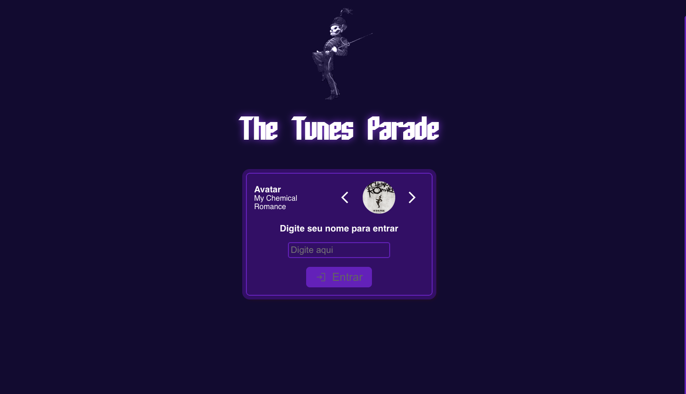
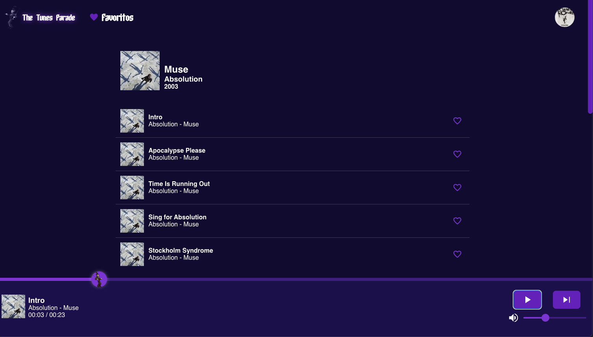

# trybe-tunes by Jhonatec
Application that uses Apple Music API to play previews of different albums.

## See online
<a href="https://trybetunes.jhonatec.dev/" target="_blank">Click here to open the preview</a>

# Functionalities
- Login with name and avatar
- Search by artist/albums
- View all songs in the album
- Music player that doesn't stop playing when changing routes
- Save/Remove songs in favorites
- Edit profile

# Used techs
- React JS
  - State Elevation
  - Props
  - MUI components
  - Class Components
- JS
  - Audio Objects throuth code
  - Assync Methods
- LocalStorage
- CSS
  - Mobile/Desktop

# Changelog

- 2023-04-27 - UX bugs solved
- 2023-04-26 - Migrate to MUI components (Slider, icons, Checkbox)
- 2023-04-23 - Start with UX
- 2023-04-22 - Core project built
